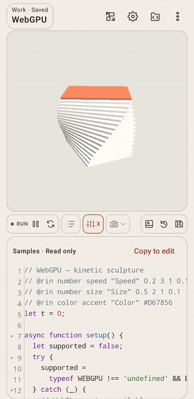

# Edit:RiN

**Edit:RiN** is a mobile creative coding environment and p5.js editor designed for Android. Create, sketch, and experiment with generative art anywhere, directly on your device.

[Official website](https://rin-code-dev.github.io/Edit-RiN/) · [日本語の案内はこちら](#日本語) · [Download](https://github.com/rin-code-dev/Edit-RiN/releases) · [Changelog](CHANGELOG.md) · [Issues](https://github.com/rin-code-dev/Edit-RiN/issues)

<p align="center">
  <a href="https://rin-code-dev.github.io/Edit-RiN/">
    
  </a>
</p>

---

## Features

- **Live Code Editing & Preview**: Interactive p5.js canvas with split-view and fullscreen mode.
- **Live Parameters**: Tweak variables on the fly with dynamic sliders and color pickers generated directly from code comments.
- **Multiple p5.js Runtimes**: Switch between **p5.js 2.3.4** (modern, async setup) and **p5.js 1.11.5** (classic compatibility) per work.
- **HTML & Modules**: Edit HTML/CSS and nested project files; run ES modules, instance sketches, and multiple canvases. Add HTTPS libraries in Runtime settings.
- **Browser Features**: Camera/microphone permissions, sketch file pickers, native file downloads, and sketch fullscreen.
- **Device Motion & Orientation**: Native tilt and motion sensors (`rotationX`/`Y`/`Z`, `accelerationX`/`Y`/`Z`, and `deviceShaken()`) for mobile-first interactive artworks.
- **Audio & Sound**: Built-in support for `p5.sound` for audio synthesis, playback, and FFT analysis.
- **Work & Asset Management**:
  - Store multiple works with revision history and ZIP backup/export.
  - Per-work asset support (images, audio, video, fonts, JSON/CSV) with instant loading-code insertion.
  - Single-work ZIP export and import for easy sharing.
  - Import public sketches directly from your p5.js Web Editor account.
- **Sharing**: The share-card button is temporarily unavailable in v2.3.0, and the former Web Player has been retired. PNG export and sharing saved images or recordings remain available.
- **Capture & Export**: Record animations (video/GIF) and capture high-resolution screenshots.
- **Customizable Environment**: Custom editor themes, fonts (TTF/OTF/TTC), ligature support, and canvas orientation toggle.
- **Multilingual Support**: Fully localized in English, Japanese (日本語), and Simplified Chinese (简体中文).
- **Privacy First**: Fully offline-capable, zero ads, no trackers or analytics.

---

## Live Parameters

Add `@rin` annotations to your JavaScript code to automatically create interactive controls in the preview panel. Values update in real time via the `rinParams` object and are saved with your sketch:

```javascript
// @rin number speed "Speed" 0 3 1 0.1
// @rin number strokeSize "Stroke size" 1 16 4 1
// @rin color ink "Color" #BA90E2

function setup() {
  createCanvas(400, 400);
}

function draw() {
  background(20);
  stroke(rinParams.ink);
  strokeWeight(rinParams.strokeSize);
  circle(width / 2, height / 2, 80 + sin(frameCount * 0.02 * rinParams.speed) * 40);
}
```

---

## Installation & Requirements

- **Supported OS**: Android 11 (API level 30) or later for v2.3.2. The published v2.3.1 release supports Android 6.0 or later.
- **Download**: Get the latest signed APK from [GitHub Releases](https://github.com/rin-code-dev/Edit-RiN/releases).
- **Updates**: Starting with the v2.3.0 release app, download future updates within the app, then install through Android’s confirmation screen. Download progress and cancellation are available.

---

## Building from Source

### Prerequisites
- JDK 25 (Java toolchain)
- Android SDK matching `compileSdkVersion` in [android/variables.gradle](android/variables.gradle) (currently API 37)
- Gradle via the included wrapper (currently 9.8.1); no separate Gradle installation is needed
- Android Gradle Plugin 9.4.1, Kotlin / Compose compiler 2.4.21, and SDK Build Tools 37.0.0 (configured by the project)

### Build Commands
```sh
./scripts/build-apk.sh debug
# Include Android unit tests:
./scripts/build-apk.sh debug --test
```

For signed release builds and configuration, refer to [RELEASE.md](RELEASE.md).
For source ownership, runtime flow, generated files, and focused checks, see
[Development guide / 保守ガイド](docs/DEVELOPMENT.md).

---

## Documentation

- [Development Guide (保守ガイド)](docs/DEVELOPMENT.md): Source map, state ownership, and validation commands.
- [Asset Guide (素材ガイド)](ASSETS.md): Managing images, audio, fonts, and data files.
- [p5.js Runtime & Sound](P5_RUNTIME_AND_SOUND.md): Runtime versions and audio setup.
- [p5.js Compatibility](P5_COMPATIBILITY.md): HTML/modules, browser features, configuration, and limits.
- [Language Support](LANGUAGE_SUPPORT.md): Localization details and supported languages.
- [Changelog](CHANGELOG.md): Release history and notes.
- [Contributing](CONTRIBUTING.md): Issues, feedback, and contribution guidelines.
- [Privacy Policy](PRIVACY.md): Data privacy and network behavior.
- [Third-Party Notices](THIRD_PARTY_LICENSES.md): Open-source licenses and acknowledgments.

---

## 日本語

Edit:RiN は、Android 端末で p5.js のコードを書き、ジェネラティブアートやクリエイティブ・コーディングを楽しめるエディタアプリです。

[公式サイト](https://rin-code-dev.github.io/Edit-RiN/)で、アプリの紹介と操作動画をご覧いただけます。サイトは英語で表示されます。

### 主な機能

- ライブプレビュー：コードを書きながら、その場で動作を確認できます。全画面表示、MP4・GIFの録画、高解像度のスクリーンショットに対応しています。
- ライブパラメータ：コードに `// @rin number ...` や `// @rin color ...` と注釈を書くと、スライダーやカラーピッカーが表示されます。値を調整すると、作品にその場で反映されます。
- 端末センサー：端末の傾きや加速度を取得し、端末を動かして操作する作品を作れます。`rotationX`/`Y`/`Z`、`accelerationX`/`Y`/`Z`、`deviceShaken()` などを使えます。
- 実行環境の切り替え：作品ごとに `p5.js 2.3.4` と `1.11.5` を選べます。`p5.sound` による音の再生・合成・解析にも対応しています。
- 素材の管理：画像・音声・フォント・JSON などを作品に取り込み、タップして読み込みコードを挿入できます。作品ごとに ZIP を書き出したり、取り込んだりして共有できます。
- 作品の共有：v2.3.0では、シェアカードのボタンを一時的に外しています。従来のWeb Playerは公開を終了しました。PNGの書き出しや、保存した画像・録画の共有は引き続き使えます。
- p5.js Web Editorとの連携：ユーザー名を入力して、公開作品を直接取り込めます。
- アプリ内更新：v2.3.0以降の正式版では、次回以降の更新用APKをアプリ内でダウンロードできます。進捗の確認や中止に対応し、Androidの確認画面からインストールします。
- プライバシー：作品の編集・実行はオフラインでも利用できます。広告やトラッキングはありません。公開作品の取り込みや更新確認には通信が必要です。

v2.3.2はAndroid 11以降に対応しています。公開済みのv2.3.1はAndroid 6.0以降に対応しています。初回のインストールには、[GitHub Releases](https://github.com/rin-code-dev/Edit-RiN/releases) から最新版の署名済みAPKをダウンロードしてください。

詳しい使い方は、[素材ガイド](ASSETS.md)や[実行環境とサウンド](P5_RUNTIME_AND_SOUND.md)をご覧ください。

---

## Support & Tips

If you enjoy Edit:RiN and would like to support its ongoing development, optional tips are welcome on [OFUSE](https://ofuse.me/rincode).

---

## License

Edit:RiN is free software: you can redistribute it and/or modify it under the terms of the GNU General Public License as published by the Free Software Foundation, either version 3 of the License, or (at your option) any later version. See [LICENSE](LICENSE) for details.

© 2026 rin-code-dev · Made with p5.js and Jetpack Compose.
